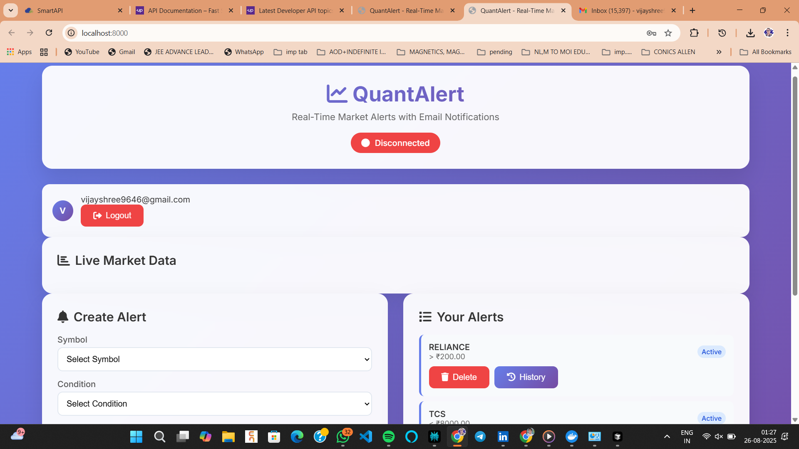
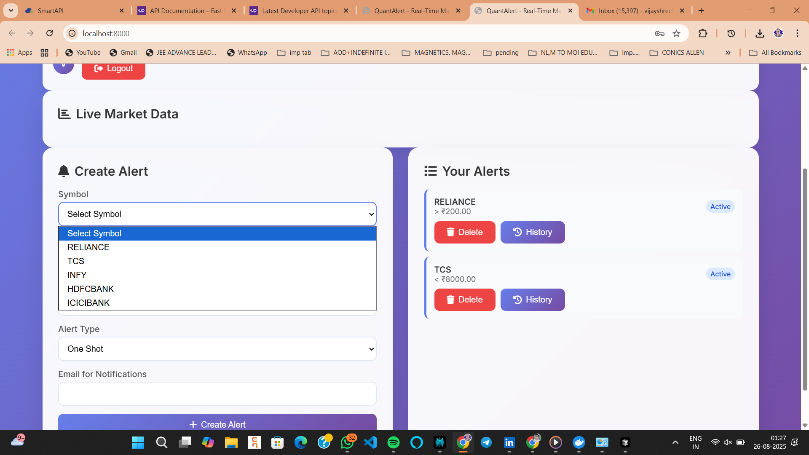
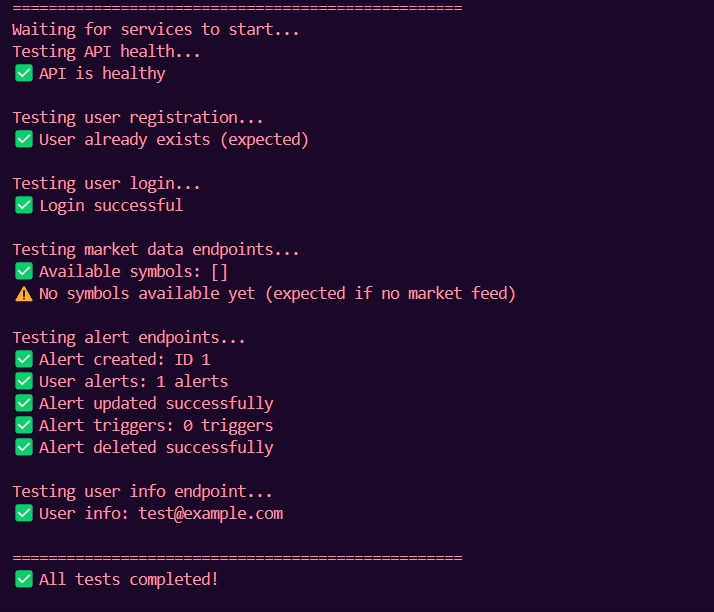
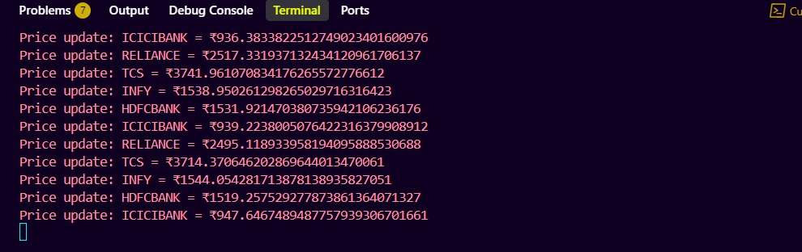

# 🌐 QuantAlert

## 🎯 Overview

QuantAlert is a **complete stock price alert system** with:

* A **modern web application** (no API keys or demat account required).
* A **production-ready backend** with real market data, broker integrations (Angel One, OpenAlgo, Upstox, Dhan), background workers, and email notifications.

Whether you're just testing alerts locally or deploying a full production setup, QuantAlert has you covered. 🚀

---

# 🌐 QuantAlert Web Application

## 🎯 **Complete Web Interface for Real-Time Market Alerts**

A beautiful, modern web application that provides real-time market data, price alerts, and email notifications — **all without requiring any demat accounts or API keys!**

---

## 🚀 Quick Start (Web App - Mock Data)

### **1. Start the Application**
```bash
python start_web.py
````

### **2. Open Your Browser**

👉 Navigate to: **[http://localhost:8000](http://localhost:8000)**

### **3. Register & Login**

* Create a new account with your email
* Login to access the dashboard

This version uses **mock data** (simulated updates every 10s) for instant setup.

---

## ✨ Features (Web UI)

### 🎨 Beautiful Modern Interface

* Responsive design (desktop, tablet, mobile)
* Real-time updates via WebSocket
* Gradient backgrounds & glassmorphism effects
* Hover animations & interactive notifications

📸 **Screenshots**


*Modern responsive dashboard with live market data*


*Email alert configuration with real-time triggers*

---

### 📊 Real-Time Market Data

* Simulated live updates every 10s
* Symbols: `RELIANCE, TCS, INFY, HDFCBANK, ICICIBANK`
* Price movement indicators (green/red)
* Volume data simulation

📸 **Screenshots**


*Testing alerts successfully with simulated market movements*


*Fetching real-time data updates in dashboard*

---

### 🔔 Smart Alerts

* Multiple conditions: `>`, `>=`, `<`, `<=`, `==`
* One-shot or recurring
* Email notifications
* Full alert management (create, edit, delete, history)

### 📧 Email Notifications

* Works with Gmail/Outlook/SMTP
* Instant alerts when triggered
* Fully configurable in `.env`

---

## 🛠️ How It Works (Web App)

* **No API Keys Required** → uses mock data
* **Real-Time Architecture**:

  1. WebSocket → real-time updates
  2. Worker → processes data & alerts
  3. SQLite → users, alerts, triggers
  4. SMTP → email notifications

---

## 📱 User Interface

* **Login/Register** → JWT authentication, bcrypt passwords
* **Dashboard** → live data cards + WebSocket connection indicator
* **Create Alerts** → pick symbol, set condition, recurring/one-shot
* **Manage Alerts** → view status/history, delete/edit

---

## 🔧 Configuration (Web)

### Email Setup (Optional)

```env
SMTP_HOST=smtp.gmail.com
SMTP_PORT=587
SMTP_USER=your-email@gmail.com
SMTP_PASSWORD=your-app-password
SMTP_FROM=alerts@quantalert.com
```

👉 For Gmail: enable 2FA → generate App Password → use in `SMTP_PASSWORD`.

---

## 🎯 Use Cases

* **Day Trading** → entry/exit alerts, breakouts
* **Investing** → target prices, portfolio monitoring
* **Learning** → test strategies, simulate alerts

---

## 🔒 Security Features

* JWT authentication
* Bcrypt password hashing
* CORS protection
* Input validation

---

## 📊 Technical Stack (Web)

* **Backend**: FastAPI
* **Frontend**: HTML, CSS, JS
* **Database**: SQLite (mock mode)
* **Real-Time**: WebSockets
* **Styling**: CSS3 + animations
* **Icons**: Font Awesome
* **Fonts**: Google Inter

---

## 🚀 Deployment

### Local

```bash
python start_web.py
```

### Production

1. Switch DB to PostgreSQL
2. Set environment variables
3. Use Gunicorn + Uvicorn workers
4. Reverse proxy with Nginx
5. Add SSL certs

---

## 🎨 Customization

* **Add Symbols** → edit `app/simple_feed.py`
* **Change Frequency** → update `await asyncio.sleep(10)`
* **Custom Styles** → edit CSS in `app/static/index.html`

---

## 🐛 Troubleshooting (Web)

* **App won’t start** → check port 8000 & dependencies
* **WebSocket issues** → check console/firewall
* **Email not working** → verify SMTP & Gmail App Password

---

## 📈 Future Enhancements (Web)

* Real market data (Yahoo/Alpha Vantage)
* Interactive charts
* Portfolio tracking
* Mobile app
* Advanced alerts (indicators, volume)
* Social trading features

---

# ⚡ QuantAlert Production System

## ✨ Features

* Real broker WebSocket feeds (Angel One, OpenAlgo, Upstox, Dhan)
* PostgreSQL (user data), DuckDB (market ticks)
* Background alert worker
* Dockerized deployment
* REST API + JWT authentication
* HTML email notifications

---

## ⚡ Market Data Integrations

✅ Angel One (SmartAPI)
✅ OpenAlgo
✅ Upstox
✅ Dhan
🔄 Mock Data (default)

👉 Full setup instructions in `.env` file.

---

## 🐳 Docker Deployment

### Start All Services

```bash
docker-compose up -d
```

* FastAPI ([http://localhost:8000](http://localhost:8000))
* Worker (alerts processor)
* PostgreSQL (db)
* MailHog ([http://localhost:8025](http://localhost:8025))

### Production Scale

```bash
docker-compose -f docker-compose.prod.yml up -d --scale worker=3
```

```
